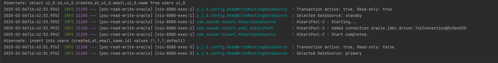

# poc-transactions-readonly

As we can see, for the GET http://localhost:8080/users, we are using a standby database (which as a Transactional(readOnly = true)), while for the creation of the user its using the primary db.

The DELAYED_ACQUISITION_AND_RELEASE_AFTER_STATEMENT strategy resolved the issue because it delays the acquisition of a database connection until Hibernate is certain the transaction's readOnly flag is properly set. This ensures the DataSource router can correctly identify the transaction context before selecting a connection.

## Why It Worked:
- Hibernate waits until the transaction is fully initialized (including the readOnly flag) before acquiring a connection.
- This ensures the ReadWriteRoutingDataSource sees the correct readOnly state when choosing between "primary" and "standby".

## Potential Pitfalls:
- Connection Leaks: Ensure your connection pool (e.g., HikariCP) is configured to validate connections.
- Long Transactions: If transactions are held open for too long, connections might not be released promptly. Adjust timeouts if needed.
